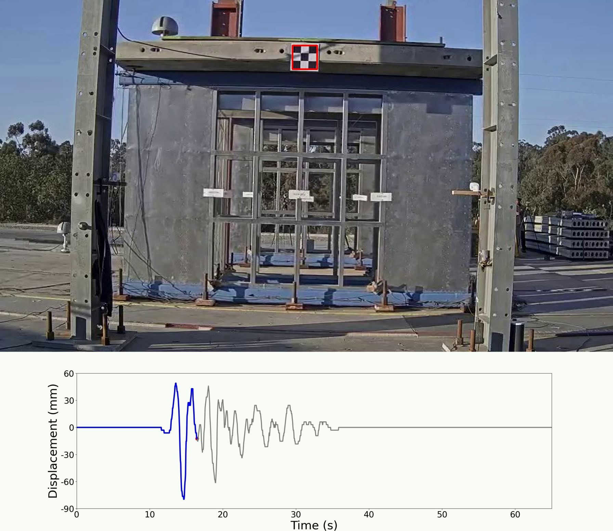

**[English](README.md) | [简体中文](README.zh-CN.md)**

# 基于视觉的结构实时位移测量（深度学习）

官方代码发布，对应论文：

> Haoyou Zhang, Xiaowei Cheng, Yi Li, Hong Guan，**"Vision-based Real-time Measurement of Structural Translational Motion Using Deep Learning and Object Tracking Methods,"** *Applied Mathematical Modelling*, 2026. [doi.org/10.1016/j.apm.2026.117187](https://doi.org/10.1016/j.apm.2026.117187)

本项目通过改进的 YOLOv5 检测器与 Deep SORT 检测并跟踪棋盘格标靶，实现结构平动位移的实时测量。主要贡献包括：

- **黑白注意力（Black-White Attention, BWA）模块** —— 由 CEB + CAB 组成、专为棋盘格标靶检测设计的注意力模块，AP 达到 93.33%（优于 SE/ECA/CBAM/CA 等基线模块）。
- **加权非极大值抑制（Weighted Non-Maximum Suppression, WNMS）** —— 缓解连续帧间检测框的抖动。
- **Deep SORT 跟踪** —— 在短时遮挡下保持目标身份的连续性。
- 在动态振动台试验（RMSE 2.05 mm）和静力往复试验（RMSE 0.11 mm）中均达到亚像素级精度，并可进行面外（深度方向）位移估计，处理速度约 35 FPS。

## 演示视频

点击缩略图观看完整视频（将打开 GitHub 内置的视频播放器）：

[](detections/shaking_table_test.mp4)

*真实振动台试验：Y-BWA-W + Deep SORT 框架对棋盘格标靶进行实时跟踪，并同步显示实时位移时程曲线。*

## 快速开始

```bash
conda create -n yolo python=3.8
conda activate yolo
pip install -r requirements.txt

python predict.py        # 使用已包含的训练权重进行推理
```

已训练好的权重（`model_data/best_epoch_weights.pth`、`model_data/ckpt_target_epoch50.t7`）已包含在仓库中，无需重新训练即可直接体验模型效果。

关于仓库结构、环境配置、数据集详情，以及如何运行/复现每一个脚本（包括论文中的验证试验），完整说明请见 **[USAGE.zh-CN.md](USAGE.zh-CN.md)**。

## 仓库结构一览

| 路径 | 说明 |
|---|---|
| `predict.py`、`main.py`、`yolo.py` | 检测/跟踪推理入口脚本 |
| `predict_video.py` | 跟踪用户在任意录制视频中选定的单个目标（详见 USAGE.zh-CN.md 第 5.8 节） |
| `validation.py`、`depth_measurement.py` | 复现论文面内、面外验证试验的脚本 |
| `nets/`、`utils/` | 模型结构（BWA-YOLO、Deep SORT）及配套工具（WNMS、数据加载、透视校正） |
| `model_data/` | 训练权重、类别/先验框文件、Deep SORT 配置以及数据集标注索引（详见 USAGE.zh-CN.md 第 3 节「数据集」） |
| `experimental_data/`、`logs/` | 录制的试验视频/传感器数据以及脚本输出结果 —— 未纳入本仓库版本控制（见下方“数据获取方式”），保存在本地／可通过运行脚本重新生成 |

## 数据获取方式

原始试验录像以及完整的 2,132 张标注图像数据集（体积过大，无法通过常规 Git 推送）已以 CC-BY 4.0 协议开放发布在 **Zenodo**：

[](https://doi.org/10.5281/zenodo.21400637)

共提供两个压缩包 —— `VOCdevkit.zip`（24.2 GB，标注好的训练/验证图像集）与 `experimental_data.zip`（19.6 GB，原始相机录像与传感器日志）。每个压缩包具体包含的内容及解压位置，请见 USAGE.zh-CN.md 第 3 节「数据集」。

## 基于以下开源项目构建

本实现基于 [bubbliiiing/yolov5-pytorch](https://github.com/bubbliiiing/yolov5-pytorch)（YOLOv5 检测器）与 [ZQPei/deep_sort_pytorch](https://github.com/ZQPei/deep_sort_pytorch)（Deep SORT 跟踪器）进行扩展，加入了论文提出的 BWA 注意力模块与 WNMS。完整的方法/文献列表请见 USAGE.zh-CN.md 第 8 节「参考文献」。

## 引用

```bibtex
@article{zhang2026vision,
  title   = {Vision-based Real-time Measurement of Structural Translational Motion Using Deep Learning and Object Tracking Methods},
  author  = {Zhang, Haoyou and Cheng, Xiaowei and Li, Yi and Guan, Hong},
  journal = {Applied Mathematical Modelling},
  year    = {2026},
  doi     = {10.1016/j.apm.2026.117187}
}
```

如果您使用了本数据集，请另行引用数据集本身 —— 数据集的 Zenodo DOI 及 BibTeX 条目见 USAGE.zh-CN.md 第 9 节「引用」。

## 许可协议

MIT —— 详见 [LICENSE](LICENSE)。

## 联系方式

Haoyou Zhang（张浩宇）—— **haoyou.zhang@marquette.edu**

无论是代码问题、如何将该方法应用到您自己的目标/试验，还是单纯想交流基于视觉的结构健康监测技术，都欢迎随时联系 —— 我很乐意讨论这项工作。
